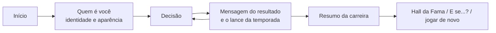

# CRAQUE v2

Simulador de carreira de futebol jogado por decisões. Você monta um jogador de
16 anos, escolhe onde jogar, no que treinar e como reagir ao que acontece, e
vê a carreira inteira acontecer dentro de um mundo de futebol simulado:
tabelas, copas, continentais, seleções, prêmios e recordes reais. Uma carreira
completa leva poucos minutos.

Este documento é a referência do projeto: quem nunca viu o código deve
entender, só por ele, como o jogo funciona, como o motor calcula e onde cada
coisa mora. O detalhe completo de cada regra está no
[GDD](docs/GDD.md) (a especificação, com notas "Como ficou" onde a
implementação mudou algo), e o porquê de cada escolha está em
[docs/DECISOES.md](docs/DECISOES.md) (D1 a D45). **Antes de mudar qualquer
coisa, leia [AI_RULES.md](AI_RULES.md).**

> Este diretório (`v2/`) é o jogo. A raiz do repositório guarda o v1 (Next.js),
> mantido só como referência histórica: o v2 é uma reescrita do zero, sem
> nenhuma linha de lógica do v1 (só a arte e o criador de personagem foram
> portados, byte a byte).

## Índice

1. [Visão geral](#1-visão-geral)
2. [O motor: as contas por trás da tela](#2-o-motor-as-contas-por-trás-da-tela)
3. [O mundo e os prêmios](#3-o-mundo-e-os-prêmios)
4. [Metagame: Desafio do dia, Hall da Fama, conquistas e "E se...?"](#4-metagame)
5. [Arquitetura técnica](#5-arquitetura-técnica)
6. [Comandos](#6-comandos)
7. [Documentação e regras para quem mexe no código](#7-documentação-e-regras)

---

## 1. Visão geral

### 1.1 O laço do jogo



1. **Início.** Ritmo e dificuldade, Começar carreira, Jogo rápido (identidade
   e aparência sorteadas), o Desafio do dia, a memória (Hall da Fama e
   conquistas) e os números do mundo. O Início é para começar: a carreira em
   andamento não aparece nele, e começar outra não pergunta nada (a anterior,
   com ao menos uma temporada, vai para o Hall como interrompida). Abrir o
   jogo de novo volta para a carreira guardada.
2. **Quem é você.** Sobrenome, número dos sonhos (opcional), pé, país (211
   seleções) e posição (12), mais o editor de aparência. O jogador montado
   fica guardado para a próxima carreira.
3. **Decisões.** A tela da carreira mostra uma decisão por vez: a primeira
   base, a janela de transferências, empréstimos, volta de empréstimo,
   dispensa, eventos, foco de treino. Cada escolha joga uma temporada (ritmo
   Normal) ou duas (ritmo Rápida).
4. **O resultado.** Não há janela para fechar. Logo depois de confirmar,
   uma mensagem animada mostra o resultado da escolha (deu certo, deu errado,
   contrato assinado, você fica, treino escolhido), e a tela já traz a próxima
   decisão, com o lance da temporada (números contando, títulos, acesso ou
   queda, atributos que mudaram) e o jornal da temporada. Era a "Revelação"
   do GDD 22; virou isto (D43 e D45).
5. **Resumo.** Quando a carreira acaba (aposentadoria, idade, falta de
   mercado), o resumo traz biografia, linha do tempo, vitrine de troféus,
   jornal, recordes reais igualados ou batidos, o pôster para compartilhar e
   o "E se...?".

### 1.2 Regras de produto que valem para tudo

- **O laço cabe numa tela.** Decisão, lance e jornal nunca rolam a página, do
  celular de 360 × 640 ao PC (D23). Só as telas de exploração (histórico,
  biografia, vitrine, Hall) rolam.
- **Ritmos.** Na tela, "Normal" é uma temporada por decisão (o padrão; no
  código, `intense`) e "Rápida" são duas (no código, `normal`). O GDD antigo
  usa "Intensa" para o Normal de hoje.
- **Dificuldades.** Normal e Difícil. O Difícil muda a chance de talento,
  cresce menos (×0,86), envelhece mais rápido (×1,25), machuca mais (×1,6),
  tira 3 do nível de mercado e dispensa mais cedo.
- **Idiomas.** Português (fonte), espanhol e inglês, em tudo, inclusive textos
  gerados (biografia, manchetes, capas).
- **Sem travessão em texto de jogo.** Os testes de idioma recusam "—" e "–".
- **Toda funcionalidade passa por duas perguntas:** cria algo interessante? O
  jogador entende o efeito facilmente? (ver [AI_RULES.md](AI_RULES.md)).

---

## 2. O motor: as contas por trás da tela

O motor (`packages/engine`) é **puro, semeado e imutável**: recebe estado e
escolha e devolve o estado novo, sem relógio, sem `Math.random`, sem React.
Todas as constantes citadas aqui estão no código, com o nome entre crases.

### 2.1 Sementes, replay e versão

- Todo sorteio vem de `stream(semente, sistema, ...partes)` (`rng.ts`):
  um gerador sfc32 por fluxo. Os sistemas são `birth`, `world`, `titles`,
  `season`, `growth`, `injury`, `awards`, `market`, `events`, `national`,
  `narrative`, `bio`, `scout`, `challenge` e `policy`. Cada torneio, cada
  temporada e cada característica do jogador tem o próprio fluxo, então mexer
  num sorteio nunca muda os outros.
- **O save é um replay** (D4): setup (semente, ano, ritmo, dificuldade,
  identidade) e a lista de escolhas. `replay()` refaz a carreira inteira e
  chega exatamente ao mesmo ponto. O save também guarda um retrato leve
  (`snapshot`) para mostrar a carreira sem rodar o motor.
- `ENGINE_VERSION` (`version.ts`, hoje `2.0.0-m8.2`) sobe sempre que a mesma
  entrada passa a produzir outra carreira. Save de outra versão abre só para
  leitura e entra no Hall pelo retrato.

### 2.2 O jogador

Criado aos 16 anos (`player/player.ts`). O jogador nunca vê os números
internos: vê atributos e OVR.

| Característica | Como sai |
|---|---|
| Talento | Jornaleiro, Promessa, Craque, Estrela, Fenômeno: 28/34/22/11/5% no Normal, 45/34/15/4/1% no Difícil (`TALENT_ODDS`) |
| Potencial P | Teto suave do nível total, uniforme na faixa do talento: 66–74, 74–81, 81–87, 87–92, 92–97 (`POTENTIAL_RANGE`). Nunca aparece; o olheiro dá uma leitura aproximada |
| Capacidade L | Habilidade natural aos 16: `46 + 1,3 × faixa + N(0; 1,6)`, entre 43 e 56 |
| Prodígio | 14% das Estrelas e 26% dos Fenômenos já chegam prontos: L começa de 11 a 17 abaixo de P (`PRODIGY_CHANCE`, `PRODIGY_GAP`) |
| Idade de pico | Atacante 26,5; meia ofensivo 26,5; meio-campo 27,5; lateral 27; zagueiro 28,5; goleiro 30 (`PEAK_AGE_BASE`), ±2 pela maturação (precoce 15%, normal 70%, tardia 15%) |
| Longevidade | 7% dos jogadores de linha (fora zagueiros) ganham 3 anos a mais antes do declínio (`LONGEVITY`) |
| Traço | Competidor, Profissional, Líder, Artista, Cabeça quente, Frágil: mexem em crescimento, declínio, lesão, risco, torcida e legado (`TRAIT_EFFECTS`) |
| DNA | Desvio por atributo, N(0; 2,2), recentrado para não mudar o OVR, só o desenho da carta |
| Treino | Bônus permanentes por atributo, de 0 a +8 |

**Atributos e OVR.** Os seis atributos da carta (Ritmo, Finalização, Passe,
Drible, Defesa, Físico; no gol, Elasticidade, Manejo, Reposição, Reflexos,
Velocidade e Posicionamento) saem de

    atributo = limitar(arredondar(L + desenho da posição + DNA + curva da idade + treino), 1, 99)

e o OVR sai **sempre** dos atributos (invariante 1):

    OVR = limitar(arredondar(média ponderada pelos pesos da posição + bônus da posição), 1, 99)

Os pesos por posição estão em `player/positions.ts`. Exemplo: centroavante
10/42/8/20/0/20 com bônus 2; zagueiro 8/0/10/4/50/28 com bônus 3.

### 2.3 Evolução: crescimento, teto biológico e declínio

A cada temporada, L cresce (`evolution/growth.ts`, `evolution/tuning.ts`):

    ganho esperado = 7,6 × idade × folga × minutos × treinador × confiança × traço × dificuldade

- **Idade**: logística que cai à metade 2,5 anos antes do pico.
- **Folga** até o potencial, com saturação:
  `(máx(P − nível, 0) + 0,35) / (… + 9)`. Quem se adiantou desacelera perto
  do teto; quem se atrasou recupera. É a "tendência à média" do modelo.
- **Minutos**: `0,45 + 0,55 × mín(1, jogos / 34)`.
- **Treinador**: de 0,85 (clube de força 55) a 1,15 (força 90).
- **Confiança**: de 0,96 a 1,04, pela torcida.
- **Forma da temporada**: normal ×0,88–1,12; tropeço (8%) ×0,45–0,7; explosão
  ×1,25–1,45, com chance de 14% até 19 anos, 10% até 22, 5% até 25, 1,5%
  depois, e só com 20 jogos ou mais.
- **Teto biológico** (`capSeasonGain`): até 4,4 pontos numa temporada passam
  inteiros; acima disso o ganho rende cada vez menos e nunca chega a 7.
  Nenhuma temporada dá um salto irreal (o maior salto de OVR medido é +9).
- **Moral de título**: +0,25 por ponto de importância do título (liga 1,0;
  Champions 2,5...), até +1,2 por temporada e nunca acima de P + 1.
- **Declínio** (`ageDecline`): começa 2 anos depois do pico, mais a folga da
  posição (zagueiro +1, goleiro +2) e a longevidade:
  `mín(4,5; 0,26 × anos + 0,05 × anos²)` por temporada, × traço × dificuldade.

### 2.4 Treino (foco)

Dos 17 aos 31 anos, no mínimo quatro anos depois do último foco, com 40% de
chance a cada decisão (`FOCUS_RULE`), aparece a decisão de foco: seis focos,
um por atributo (Arranque, Pontaria, Visão de jogo, Bola no pé, Marcação,
Força; no gol, Voo, Mãos firmes, Reposição, Reflexos, Explosão, Comando da
área). O foco soma **+2** ao atributo uma vez, no período seguinte, e garante
que ele termine o período pelo menos 2 acima de onde começou
(`TRAINING.focus`, `guaranteeFocus`).

### 2.5 Uma temporada do jogador

`season/playerSeason.ts`, nesta ordem:

1. **Papel no elenco** pela distância `d = OVR − força do clube`
   (`season/role.ts`): Craque do time (d ≥ 3, joga 95% dos jogos), Titular
   (d ≥ −1, 85%), Rotação (d ≥ −4, 60%), Reserva (d ≥ −8, 28%), Sem espaço
   (8%). Goleiro: Titular (d ≥ −2, 92%), Reserva (d ≥ −7, 12%), Terceiro (2%).
   Quem não é titular tem de 2% a 8% de chance de subir um degrau na
   temporada.
2. **O mundo inteiro** (seção 3), com o jogador somando força ao clube:
   `força + 0,22 × participação × limitar(OVR − força, −3, 15)`
   (`CLUB_IMPACT`), e à seleção (`NATIONAL_IMPACT`, 0,12).
3. **Jogos e lesão.** Jogos planejados = jogos do time × participação ×
   N(1; 0,06). Lesão (`season/injury.ts`): chance
   `0,14 × (1 + 0,05 por ano acima dos 28) × (1,15 − 0,3 × físico / 99) × traço × (1,6 no Difícil)`;
   tira de 5% a 22% dos jogos planejados.
4. **Produção**, competição por competição (`season/production.ts`). Os jogos
   dele são repartidos entre as competições na proporção dos jogos do time, e
   cada competição sorteia:
   - gols e assistências por **Poisson**, com taxa por jogo
     `base da posição × e^(0,044 × v(OVR − oposição)) × e^(0,03 × v(time − oposição)) × e^(0,035 × (Finalização − OVR)) × fase`,
     onde `v(d)` vale d até 10 e `10 + 0,3 × (d − 10)` acima (o joelho que
     impede 60 gols todo ano). Base de gols por jogo: centroavante 0,385;
     pontas 0,24; meia ofensivo 0,22; meias abertos 0,15; volante e laterais
     0,035; zagueiro 0,04 (`SCORING`).
   - jogos sem sofrer gol por **binomial**, com chance
     `e^(−1,05 × sofridos por jogo)` e
     `sofridos = 1,2 × e^(−0,055 × (time + defesa − oposição))`.
   - a fase da temporada é log-normal (o Artista oscila mais).
5. **Seleção** (`season/national.ts`): pela distância `OVR − força da
   seleção`, Titular (≥ 2: 9 a 11 jogos fora de torneio), Elenco (≥ −1: 5 a 7),
   Ocasional (≥ −3: 1 a 3) ou fora; nos anos de torneio, joga o torneio.
   Produção com escala 0,6 (jogo de seleção é mais travado).
6. **Títulos**: título de clube só conta para quem jogou naquela competição;
   título de seleção, para quem estava no elenco do torneio.
7. **Prêmios** (seção 3.4) e **pressão do recorde** (2.6).
8. **Evolução** (2.3).

### 2.6 Pressão do recorde

Recorde é possível e raríssimo (D44, `records/pressure.ts`). Cada número que
encosta num recorde real tem uma cauda: até o começo dela nada muda; dali em
diante, cada unidade a mais (gol, jogo, convocação, título, Bola de Ouro) só
entra se passar num sorteio, e a chance cai a cada passo:

    chance do passo n = e^(−n / escala)

Exemplo: gols numa temporada têm cauda a partir de 62, escala 6. O 73º gol
entra com 16% de chance, o 74º com 14%, o 80º com 5%. Valem caudas para gols
na temporada, assistências, jogos sem sofrer gol do goleiro, gols e jogos na
carreira, gols e jogos pela seleção, títulos (total, por liga, por
continental, Copa do Mundo, sequências de ligas e de continentais), Bolas de
Ouro (total e seguidas) e Chuteiras de Ouro. Nada tem teto (invariante 4). O
título que a sorte não confirma fica com o vice, logo que o torneio acaba (o
mundo continua coerente); o prêmio fica com o segundo colocado. Em 2.250
carreiras de Fenômeno perseguindo recorde, todos os recordes foram
alcançados, quase sempre poucos acima da marca
(`tools/balance/relatorios/recordes.md`).

### 2.7 A carreira: decisões, mercado e fim

**A próxima decisão** (`career/decisions.ts`) é a primeira regra que se
aplicar: idade 40 (fim), sem mercado (fim), suspensão, volta de empréstimo,
dispensa, evento agendado, foco de treino, empréstimo e, por fim, a janela de
transferências.

- **Primeira base** (`ACADEMY`): três clubes do país do jogador, cada um da
  primeira divisão com 30% de chance e da segunda no resto. Quem nasceu fora
  dos 17 países com liga jogável recebe clubes da confederação ou do mundo
  perto de OVR + 6.
- **Mercado** (`career/market.ts`). O nível de mercado é o OVR, mais até +5
  para quem tem menos de 23 anos (0,8 por ano), mais reputação (até +3),
  menos 3 no Difícil, menos 1,5 por ano acima dos 32. Os interessados têm
  força entre nível − 7 e nível + 3 (a faixa se alarga quando faltam clubes:
  o jovem alcança clubes mais fortes, o veterano mais fracos). A região vem
  do OVR (abaixo de 75: metade do próprio país, 30% da confederação, 20% do
  mundo). Uma oferta é sempre um passo acima (pelo menos 2 de força a mais) e
  outra um lugar onde ele será protagonista: é isso que faz a escolha doer.
  Cada oferta mostra liga, estrelas, papel esperado, missão, pressão,
  competições e o número da camisa.
- **Missão** (10, `career/mission.ts`): Aposta da base, Reforço, Peça do
  projeto, Contratação de peso, Herdeiro, Resgate, Reconstrução, Volta para
  casa, Experiência, Mostrar serviço. Cada uma define torcida inicial,
  pressão (multiplica as quedas de torcida) e exigência.
- **Torcida e legado** (`career/fans.ts`): torcida de 0 a 100 por clube, em
  faixas (Desconhecido, Hostil, Morna, Calorosa, Querido, Idolatrado). O
  primeiro clube começa em 50 e, na primeira temporada, a torcida só sobe.
  Títulos, jogos e gols somam legado (Sem legado até Lenda do clube). Trocar
  um clube pelo rival de clássico marca Traidor.
- **Empréstimo** (`LOAN`): de 18 a 23 anos, no máximo dois na carreira, para
  quem ficou como reserva, sem espaço ou terceiro goleiro (60% de chance) ou
  na rotação (25%). Na volta, as
  opções são clubes de verdade: voltar ao dono do passe, ficar no clube do
  empréstimo (compra, 40% ou 70% de chance de existir) ou o mercado.
- **Dispensa** (`RELEASE`): a partir dos 25 anos e duas temporadas seguidas
  sem espaço (23 e uma no Difícil): três clubes, nunca o que dispensou.
- **Camisa** (`career/shirt.ts`): o número dos sonhos quando o clube permite;
  titulares e craques ganham os números clássicos da posição (1, 9, 10...),
  reservas os altos. Número que não combina com a posição (a 10 de um
  goleiro) só sai com 0,8% de chance, para o craque do time. A camisa só muda
  na transferência (a oferta mostra) ou na opção de ficar, quando o clube
  oferece outra.
- **Fim**: aos 40 anos; sem nenhuma oferta; ou por vontade própria (a opção
  aposentar aparece nas janelas a partir dos 33, depois de dispensa a partir
  dos 32; "Encerrar carreira" no menu vale depois da primeira temporada
  jogada, e a partir dos 27 no Desafio do dia).

### 2.8 Eventos declarativos

Um evento é **dado**, não código (`events/model.ts`, `events/catalog.ts`, 39
eventos): condições para aparecer, opções e os efeitos de cada resultado.

- **Condições**: idade, jogos na última temporada, papel, temporadas no
  clube, continental, mata-mata, clube rival interessado, clássico, declínio
  do clube, a 10 livre, tempo no exterior, valor de mercado, seleção fraca ou
  sem estreia, legado em outro clube, elenco de torneio, torcida, OVR, traço,
  posição vizinha, número histórico livre, homenagem, ou "qualquer uma de".
- **Efeitos**, aplicados na ordem: capacidade (agora, no período ou depois),
  potencial, atributos, torcida, pressão, papel (sobe, desce, titular
  garantido), jogos, lesão, produção, crescimento, força por torneio, final
  decidida (a final sempre acontece, D45), seleção (pular ou ir ao torneio),
  suspensão, transferência, posição, nacionalidade, camisa, bloquear o clube,
  mercado, força do clube, bônus de prêmio e marcas de história (para a
  biografia).
- **Opções**: de risco (chance de sucesso, ajustada pelo traço), seguras, de
  mudança e de escolha. A interface mostra o que muda em cada caso.
- **Agenda** (`career/events.ts`): no começo da carreira, o motor sorteia de
  7 a 8 idades com evento (4 a 5 no ritmo Rápida), entre 17 e 37 anos; na
  idade marcada entra um evento elegível sorteado pelo peso.
- Os textos ficam em `@craque/content` pelo id do evento e da opção: um evento
  novo é uma entrada no catálogo e um bloco de texto em cada idioma.

---

## 3. O mundo e os prêmios

### 3.1 Os dados (`packages/world`)

489 clubes com força (40 a 92, na escala do OVR) e prestígio (1 a 5), 211
seleções, 32 ligas (primeira e segunda divisão) de 17 países jogáveis
(ARG, BOL, BRA, CHI, COL, ECU, ENG, ESP, FRA, GER, ITA, MEX, PAR, PER, URU,
USA, VEN), 79 competições, prêmios e uniformes. As notas dos clubes saem e
voltam por planilha (`pnpm notas:exportar` e `pnpm notas:importar`).

### 3.2 Uma temporada do mundo (`world/season.ts`)

Ordem: supercopas, ligas, copas, continentais, Intercontinental, Mundial de
Clubes, seleções e, por fim, acesso, rebaixamento e a força nova dos clubes.
Cada torneio sorteia no próprio fluxo.

- **Liga**: cada clube tira uma nota = força efetiva + N(0; 3,1); a tabela é
  a ordem das notas, e os pontos por jogo são
  `limitar(1,36 + 0,078 × (nota − média), 0,35, 2,63)` (pontos nunca crescem
  com a posição).
- **Copas e continentais**: mata-mata ordenado por nota (força + ruído de 4,2
  nas copas e continentais, 5,2 na copa da liga, 3,4 no Mundial). Jogo único
  (supercopa, final da Intercontinental):
  `P(A vence) = 1 / (1 + e^(−(A − B) / 4,5))`.
- **Classificação continental** pela tabela, por país (`QUALIFICATION`).
- **Calendário**: Copa do Mundo nos anos com resto 2 por 4 (2026, 2030), os
  continentais de seleções (Eurocopa, Copa América, Copa Ouro, Copa Africana,
  Copa da Ásia, Copa da OFC) com resto 0, Mundial de Clubes com resto 1.
- **Acesso e rebaixamento** entre as divisões de cada país.
- **Força ao longo do tempo** (`CLUB_DRIFT`): volta 30% para a força base,
  soma sucesso (liga +0,4, continental principal +0,6, acesso +0,5,
  rebaixamento −0,8) e ruído; fica entre 35 e 95. Dinastia sim, monopólio não.
- O mundo começa com 4 temporadas de aquecimento (só memória, sem mexer em
  força nem divisão).

### 3.3 Quem disputa os prêmios

- **A elite real** (D8, `awards/elite.ts`): jogadores de verdade com
  projeções de carreira fictícias (sobe 1,9 por ano até o pico, cai depois).
- **A geração futura**: a elite real só vai até quem nasceu em 2009; para a
  Bola de Ouro não virar prêmio sem adversário depois de 2037, o motor gera,
  pela semente da carreira, dez candidatos por ano de nascimento de 2009 a
  2028 (pico médio 86,5). O motor não dá nome a eles: `@craque/content`
  monta nomes fictícios que soam do país de cada um.

### 3.4 Os prêmios (`awards/awards.ts`, `awards/crowns.ts`)

- **Bola de Ouro**: eleição entre o jogador e a elite. Nota =
  OVR + 2,2 × sucesso (liga 1, copa 0,3, continental 2,5, Copa do Mundo 3,
  continental de seleções 1,5) + produção + ajuste da posição (atacante 0,
  zagueiro −2,5, goleiro −3) + prestígio (0,8 por Bola anterior, até 4) −
  freio de sequência (2 por ano seguido, até 5) − fama (0,8 por ano abaixo
  dos 22) + N(0; 1,6). Cada candidato da elite ganha +3,3 (o resto do mundo).
  Mínimo de 25 jogos.
- **Luva de Ouro** (goleiros), **Revelação** (até 21 anos, 20 jogos).
- **Chuteira de Ouro**: só clubes da UEFA. A marca a bater é o artilheiro que
  ganharia sem o jogador, máx(28, N(35; 3,5)), mais 1,2 por Chuteira seguida;
  ganha quem faz mais gols de liga que isso.
- **Artilheiro e Craque de cada competição** (ligas, copas, continentais,
  Mundial, torneios de seleção): artilharia contra a marca dos artilheiros
  reais daquela competição (abaixo dela, impossível; acima do recorde,
  certa); craque por nota de desempenho, com mínimo de 60% dos jogos.
- **Recordes reais** (GDD 26, 18 marcas conferidas em setembro de 2026): 73
  gols numa temporada, 979 na carreira, 8 Bolas de Ouro (4 seguidas), 6
  Chuteiras, 46 títulos, 3 Copas do Mundo, 6 Champions, 6 Libertadores, ligas
  de Inglaterra (13), Espanha (12), Itália (10), Alemanha (13), 11 ligas
  seguidas, 5 continentais seguidos, 146 gols e 234 jogos pela seleção, 1.390
  jogos na carreira. O resumo mostra os igualados ou batidos.

---

## 4. Metagame

### 4.1 Desafio do dia (`packages/engine/src/challenge`)

- **O dia é UTC.** O identificador é a data em UTC (`AAAA-MM-DD`), calculada
  com aritmética inteira de calendário (sem `Date`; o motor nunca lê o
  relógio, quem chama passa o instante). Vira exatamente na meia-noite UTC
  para todo mundo.
- **A mão do dia** sai só do identificador: nação (com liga jogável),
  posição, talento do jogador do dia, três missões de três eixos diferentes
  e um édito. Nação, posição e édito andam em **rodízio** determinístico:
  cada nação uma vez antes de repetir, cada posição a cada 12 dias, cada
  édito a cada 10, e nunca o mesmo de um dia para o outro (D31).
- **Missões**: 36, em 9 eixos (gols, títulos, fidelidade, estrada, evolução,
  zebra, seleção, longevidade, prêmios), com alvo por faixa de talento,
  calibrado por `pnpm desafio:calibrar` (D29). A terceira é surpresa e só se
  revela aos 24 anos.
- **Éditos**: 10 restrições (D30), cada uma quebra de 10% a 75% das carreiras.
- **Regras fixas**: dificuldade Difícil, duas temporadas por decisão,
  aposentar a partir dos 27; livres o sobrenome, o pé, a aparência e o número.
- **Pontuação** (sobre 1000, `challenge/score.ts`):

      missão(r = progresso / alvo) = 400 × (1 − e^(−2,2 r)) / (1 − e^(−2,2))   se r ≤ 1
                                   = 400 + mín(50; 45 × log2 r)                  se r > 1
      total = arredondar((duas melhores missões + bônus de pico) × (édito cumprido ? 1 : 0,5) × 0,97^temporadas apagadas)
      bônus de pico = 100 × limitar((OVR de pico − 72) / 27, 0, 1)^1,4

  A primeira tentativa terminada no dia é a **ranqueada**; as outras são
  amistosas.

### 4.2 Hall da Fama e conquistas

- **Banco**: IndexedDB `craque-v2` com as lojas `archive`, `achievements` e
  `leaderboard` (`apps/game/src/services/database.ts`). Na abertura tudo é
  lido para um **espelho em memória**; a leitura vem do espelho e a escrita vai
  para o espelho e depois para o disco. Se o IndexedDB não existe, não abre
  (aba anônima), demora ou falha numa escrita (cota cheia), o banco vive só
  em memória até fechar a aba, o jogo segue igual e um aviso discreto aparece
  uma vez.
- **Entra no Hall**: toda carreira terminada; a interrompida (substituída por
  outra) com ao menos uma temporada; saves de versão antiga, pelo retrato. A
  linha alternativa do "E se...?" não entra.
- **Abrir uma carreira do Hall** refaz o resumo por replay, só para leitura;
  apagar pede confirmação.
- **Conquistas**: 49 (`packages/content/src/achievements.ts`), derivadas da
  carreira terminada (ex.: todas as grandes ligas, um clube só, Setenta e
  três). Aparecem num aviso quando liberadas.

### 4.3 "E se...?"

No resumo de uma carreira comum (não do Desafio), o capítulo "E se...?"
lista cada decisão tomada. Escolher uma refaz a carreira por replay até ali
e continua ao vivo, com a opção que você não escolheu. A linha alternativa é
só para se divertir: não entra no Hall e não libera conquista (D43).

### 4.4 O resumo e o compartilhamento

Biografia gerada do diário da carreira (`career/log.ts`), linha do tempo,
vitrine de troféus, o jornal da carreira (capas por temporada), recordes
reais, a carta do auge e o **pôster PNG** (gerado com modern-screenshot, com
opção de esconder o sobrenome; carta com selo "Difícil" ou "Desafio"). O
**link da carreira** leva o replay inteiro no fragmento da URL (`#c=`,
comprimido com deflate-raw): abrir o link refaz a carreira e mostra o resumo
só para leitura, sem tocar no save de quem abre.

---

## 5. Arquitetura técnica

### 5.1 Pacotes e a regra das dependências

```
v2/
├─ packages/world/    dados do mundo e consultas (países, ligas, clubes, competições, prêmios, kits)
├─ packages/engine/   o motor: puro, semeado, imutável; depende só de world
├─ packages/content/  todos os textos do jogo (pt, es, en): eventos, capas, manchetes, biografia,
│                     recordes, desafio, conquistas, nomes da geração futura; depende de engine e world
├─ packages/art/      arte gerada: escudos, selos, troféus e o avatar (portados do v1, byte a byte)
├─ apps/game/         o jogo: Vite + React 19; depende de todos acima
├─ tools/balance/     harness de balanceamento: metas do GDD 40 e relatórios
├─ tools/terminal/    uma carreira inteira no terminal (pnpm carreira)
└─ docs/              GDD.md (especificação) e DECISOES.md (D1 a D45)
```

- **O motor não sabe que existe interface.** Nada em `packages/engine`
  importa React, DOM, relógio, armazenamento ou textos. Um teste de pureza
  (`packages/engine/test/purity.test.ts`) varre o código do motor e falha com
  `Math.random`, `Date`, APIs de navegador ou de Node. Toda regra de jogo mora no motor; o app só mostra e pergunta.
- **Textos fora do motor.** O motor devolve ids e números; `@craque/content`
  transforma em frases nos três idiomas. A interface tem os próprios textos em
  `apps/game/src/i18n` (português é a fonte, os tipos obrigam es e en a ter
  as mesmas chaves).
- **Carreira = estado imutável.** `createCareer(setup)` → `choose(carreira,
  escolha)` → `{ carreira, avisos }`. Os avisos (temporada, transferência,
  resultado do evento, primeira convocação) alimentam o lance e a mensagem.

### 5.2 O app (`apps/game`)

| Parte | O que faz |
|---|---|
| Pilha | Vite 8, React 19 com React Compiler, TypeScript 6, Tailwind 4.3, Base UI, Motion 13, Zustand 5 |
| `src/app/` | Casca (barra do topo sempre visível), navegação por `history.state` (a URL não muda entre telas, nenhum host precisa de regra de reescrita), barreiras de erro em três níveis, telas carregadas sob demanda e baixadas em segundo plano depois da primeira pintura |
| `src/screens/` | Início, Identidade, Aparência, Carreira (decisão, lance, jornal, mensagem do resultado), Resumo, link compartilhado, Desafio, Hall da Fama, carreira arquivada, Conquistas, 404 e o laboratório |
| `src/features/` | Estado da carreira (`career/store.ts`, Zustand), save, rascunho do jogador, lance (`play.ts`) e mensagem (`resultView.ts`), "E se...?", resumo (pôster, link, vitrine), desafio (relógio), Hall (banco, ranking, conquistas), aparência, ajustes |
| `src/services/` | Som, vibração, `localStorage` seguro, IndexedDB com espelho em memória, imagens offline |
| `src/ui/` | Sistema de design: botões, carta do jogador, números que contam, sinais e pílulas, painéis, janelas, avisos |
| `src/i18n/` | Português (fonte), espanhol, inglês |

**Save.** `localStorage`: `craque.v2.save` (replay + retrato + avatar + tela),
`craque.v2.draft` (o último jogador montado) e `craque.v2.prefs` (idioma,
tema, volume, movimento, vibração, ritmo, dificuldade). Cada escolha grava
na hora; recarregar abre na mesma tela. Save corrompido é descartado com
aviso, e o rascunho fica.

**Acessibilidade.** Laço inteiro por teclado (Tab, Enter, Espaço), o foco
volta ao título da decisão nova, o lance é anunciado numa frase para o leitor
de tela, contraste WCAG AA nos dois temas (inclusive com as cores dos
clubes), movimento reduzido respeitado (do sistema ou dos ajustes).

### 5.3 PWA e imagens

- **PWA** com `vite-plugin-pwa` (D36): instalável, funciona sem internet
  depois de aberto uma vez. A casca do jogo (código, estilos, fontes,
  bandeiras, selos e ícones) entra no precache da instalação.
- **Escudos, troféus e federações** entram no cache `craque-imagens`
  conforme aparecem. Ajustes > "Imagens sem internet" > "Guardar todas" baixa
  o resto (cerca de 22 MB).
- **Imagem real ou gerada.** Cada clube, liga, troféu e prêmio tem arte
  gerada em `packages/art` (desenhada no navegador, sem rede). No modo
  `VITE_ASSETS=real` (padrão), o jogo usa a imagem real quando existe e a
  gerada quando falta (sem internet e fora do cache, nenhum escudo aparece
  quebrado). `VITE_ASSETS=gerado` usa só a gerada (copie
  `apps/game/.env.example` para `.env.local`). Hoje 399 dos 489 clubes têm
  escudo real.
- **Páginas de erro estáticas** (404, 403, 500, 503) geradas no build com os
  textos e desenhos do jogo, nos três idiomas (D38).

### 5.4 Qualidade

- **Testes unitários** (Vitest) em cada pacote: motor (pureza, replay,
  propriedades, regras), conteúdo (textos sem marcador sobrando, idiomas
  iguais, biografia coerente), app (save, lance, Hall, desafio).
- **Ponta a ponta** (Playwright no Chrome instalado, sobre o build de
  produção, celular 375 × 812 e desktop 1280 × 800): jornada do Início ao
  Resumo, recarregar, Desafio, Hall com "E se...?", erros, offline e
  acessibilidade (axe nos dois temas, teclado, leitor de tela).
- **Balanceamento** (`tools/balance`): milhares de carreiras com políticas
  automáticas contra as 51 metas do GDD 40 (evolução, mundo, carreira,
  fluxo, desafio), e o relatório de recordes.

---

## 6. Comandos

Pré-requisitos: Node.js 22.12 ou mais novo e pnpm 10. Tudo dentro de `v2/`.

**Jeito fácil (Windows):** dois cliques em `iniciar.bat` (confere o Node,
instala o pnpm se faltar, instala as dependências e abre o jogo em
http://localhost:5173). `carreira.bat` joga uma carreira no terminal.

```bash
pnpm install
```

```bash
pnpm start
```

| Comando | O que faz |
|---|---|
| `pnpm start` | Servidor de desenvolvimento e abre o navegador |
| `pnpm dev` | O mesmo, sem abrir o navegador (http://localhost:5173) |
| `pnpm build` | Build estático em `apps/game/dist` (com service worker e páginas de erro) |
| `pnpm preview` | Serve o build de produção |
| `pnpm test` | Testes unitários de todos os pacotes |
| `pnpm typecheck` | Checagem de tipos |
| `pnpm lint` | Regras de código (ESLint) |
| `pnpm verify` | Tipos, regras, testes, metas de balanceamento e build: rode antes de entregar qualquer mudança |
| `pnpm e2e` | Suíte ponta a ponta (precisa do Google Chrome; fica fora do `verify`) |
| `pnpm balance` | Metas do GDD 40 com milhares de carreiras; grava `tools/balance/relatorios/` |
| `pnpm balance:check` | O mesmo, menor e sem gravar arquivo; falha se alguma meta falhar |
| `pnpm balance:recordes` | Fenômenos perseguindo recordes; grava `relatorios/recordes.md` |
| `pnpm desafio:calibrar` | Recalibra os alvos das missões do Desafio do dia |
| `pnpm carreira` | Uma carreira inteira no terminal, com o motor e os textos de verdade |
| `pnpm notas:exportar` / `pnpm notas:importar` | Planilha de força e prestígio dos clubes, ida e volta |
| `pnpm --filter @craque/game icones` | Redesenha os ícones do PWA a partir da marca |

### 6.1 Laboratório

Só em desenvolvimento: http://localhost:5173/#lab (ou o botão Laboratório no
pé do Início). Áreas:

- **Desafio**: as mãos de hoje e dos próximos 13 dias, com Simular.
- **Fim de carreira**: uma carreira jogada sozinha, com pôster, biografia e
  "Abrir no resumo".
- **Cartas**: a carta nas cinco faixas, números que contam, selos Difícil e
  Desafio.
- **Design**: as peças da interface, avisos e a mensagem do resultado em todas
  as variantes.
- **Mundo**: clubes por país e divisão, com as notas, e as 211 seleções.
- **Arte**: escudos, selos, troféus e prêmios, reais e gerados.
- **Avatar**: o criador de personagem e uma galeria.
- **Motor**: um jogador evoluindo dos 16 aos 39 contra a faixa de jogadores
  parecidos, com tudo escolhível.
- **Temporadas**: um mundo de 2026 a 2050 sem jogador, com todos os
  campeões.

### 6.2 Ponta a ponta

```bash
pnpm e2e
```

Gera o build, sobe o `vite preview` em http://localhost:4173 (feche qualquer
outro servidor nessa porta antes) e joga no Chrome do sistema. O relatório
fica em `apps/game/e2e-relatorio/`; falhas deixam foto e rastro em
`apps/game/e2e-resultados/`. Uma parte só:

```bash
pnpm e2e e2e/jornada.spec.ts --project=desktop
```

### 6.3 Relatórios de balanceamento

```bash
pnpm balance
```

Imprime as 51 metas com ✓ ou ✗ e grava em `tools/balance/relatorios/`:
`evolucao.md` (o jogador: OVR por idade, faixas, posições, Difícil, ritmos),
`mundo.md` (60 mundos sem jogador: campeões, dinastias, acesso), `carreira.md`
(gols, Bolas de Ouro, Chuteiras, continentais), `fluxo.md` (o laço de
verdade: fim de carreira, eventos, empréstimos, traições) e `desafio.md` (10
anos de mãos). Os relatórios são versionados como registro de validação.

```bash
pnpm balance:recordes
```

Joga 150 Fenômenos por posição em três lotes (ambicioso, fiel, fiel ao
gigante) até o fim e mostra, para cada recorde, o melhor do lote, a mediana,
quantos alcançaram e quantos passaram por 1, 2 e 3.

### 6.4 Carreira no terminal

```bash
pnpm carreira
```

| Opção | Exemplo | O que faz |
|---|---|---|
| `--semente` | `--semente minha-carreira` | A mesma semente com as mesmas escolhas dá a mesma carreira |
| `--posicao` | `--posicao cam` | gk, cb, lb, rb, cdm, cm, cam, lm, rm, lw, rw, st |
| `--pais` | `--pais ARG` | Código de três letras do país |
| `--ritmo` | `--ritmo rapida` | `normal` (padrão, uma temporada por decisão) ou `rapida` (duas) |
| `--dificuldade` | `--dificuldade dificil` | `normal` ou `dificil` |
| `--idioma` | `--idioma es` | `pt`, `es` ou `en` |
| `--sobrenome`, `--numero` | `--sobrenome ROCHA --numero 10` | Nome na camisa e número dos sonhos |
| `--auto` | `--auto ambitious` | Joga sozinho: `balanced`, `ambitious`, `loyal` ou `random` |
| `--resumo` | `--auto --resumo` | Com `--auto`, só o resumo final |
| `--salvar`, `--carregar` | `--salvar minha.json` | Grava o save a cada decisão; carrega e continua |

Durante o jogo: o número escolhe, `h` mostra o histórico, `s` salva, `q` sai.

### 6.5 Notas dos clubes

1. `pnpm notas:exportar` gera `packages/world/data/clubes.csv` (separador `;`,
   abre direto no Excel em português).
2. Edite só `forca` (40 a 92) e `prestigio` (1 a 5).
3. `pnpm notas:importar` confere a planilha inteira e grava em
   `packages/world/data/clubs/`; uma linha errada recusa o arquivo todo.

---

## 7. Documentação e regras

- **[AI_RULES.md](AI_RULES.md)**: as regras para qualquer pessoa ou IA que
  mexer no projeto. A principal: toda mudança de funcionalidade, arquitetura
  ou lógica do motor atualiza este README e o GDD na mesma entrega.
- **[docs/GDD.md](docs/GDD.md)**: a especificação completa, seção por seção,
  com as metas de balanceamento (seção 40) e notas "Como ficou" onde a
  implementação mudou algo.
- **[docs/DECISOES.md](docs/DECISOES.md)**: cada decisão de arquitetura e de
  produto, com o porquê (D1 a D45). Decisão nova ganha o próximo número.

### Marcos

| Marco | Entrega |
|---|---|
| M0 a M2 | GDD, workspace, dados refeitos, arte e avatar portados, o jogador e a evolução |
| M3 e M4 | O mundo simulado, prêmios, mercado, eventos e o laço completo |
| M5 e M6 | Telas de entrada, carreira, save, resumo, biografia, jornal, pôster |
| M7 | Desafio do dia, Hall da Fama, conquistas, "E se...?" |
| M8 | Páginas de erro, PWA, acessibilidade, e2e |
| Depois do M8 | Regras do motor revistas (D42), interface sem revelação (D43), pressão do recorde (D44), mensagem do resultado e Início sem perguntas (D45): versão 2.0.0 |
